## 14.  Создание администраторской панели

Цели практической работы:

- Научиться интегрировать админ-панель в проект.
- Разобраться в настройке CRUD-методов для сущности в voyager.

Что нужно сделать:

В этой практической работе вы создадите панель администратора для склада интернет-магазина.

1. Создайте новый проект Laravel или откройте уже существующий.

2. Создайте новую ветку вашего репозитория от корневой (main или master).

3. Создайте класс Category (модель, миграцию и контроллер) командой `php artisan make:model Category -m`

4. Опишите миграцию для таблицы categories c типами полей:

```
$table->id();
$table->string('name');
$table->timestamps();
```

5. Создайте класс Product (модель, миграцию и контроллер) командой `php artisan make:model Product -m`

6. Опишите миграцию для таблицы products c типами полей:

```
$table->string('sku');
$table->id();
$table->string('sku');
$table->string('name');
$table->foreignId('category_id')->constrained();
```

7. Выполните миграцию командой `php artisan migrate`

8. Установите voyager командой `composer require tcg/voyager`

9. Выполните установку voyager внутри вашего приложения командой `php artisan voyager:install`

10. Создайте администратора вашего приложения командой `php artisan voyager:admin your@email.com`

11. Войдите в панель администратора, перейдите во вкладку tools/bread и добавьте возможность редактирования сущностей category и product.

12. После создания CRUD для сущности product перейдите в эту сущность и нажмите на кнопку Create A Relationship.

13. Настройте связь следующим образом:

 

14. Сохраните связь.

15. Создайте категорию, а после — тестовый товар, прикреплённый к этой категории.

16. Создайте в проекте директорию App/Admin/Widgets и добавьте туда два виджета: ProductsWidget и CategoriesWidget.

17. Реализуйте в этих виджетах счётчики количества товаров и категорий.

18. Добавьте виджеты в конфигурационный файл voyager.php:

```
'widgets' => [
\App\Admin\Widgets\ProductsWidget::class,
\App\Admin\Widgets\CategoriesWidget::class,
],
```

Скрины к  ДЗ

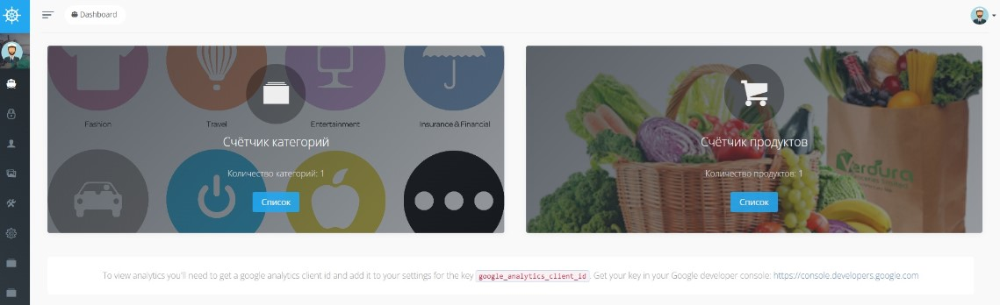 
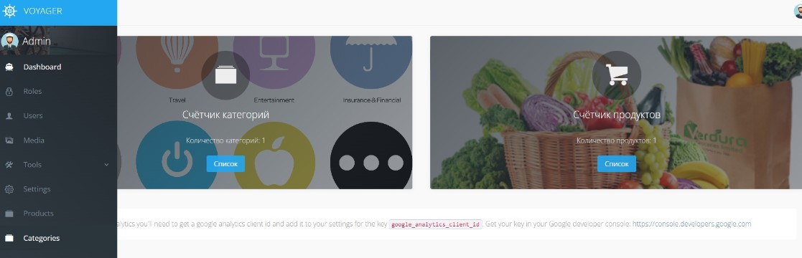 
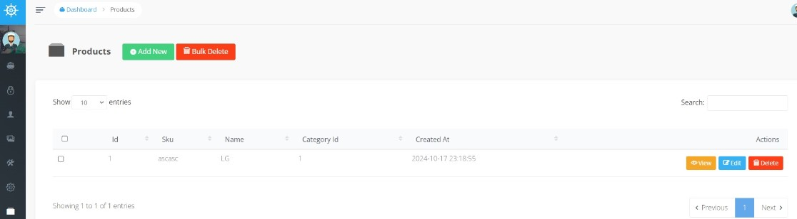
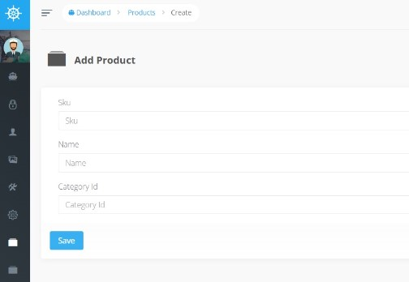 
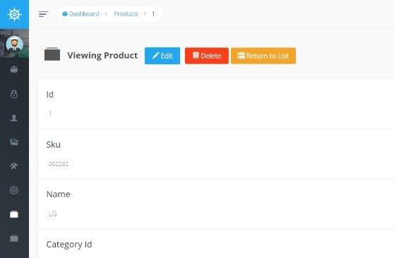
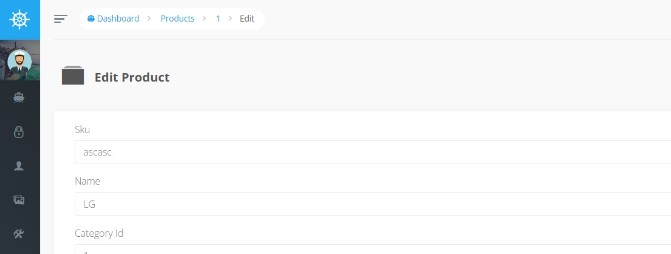
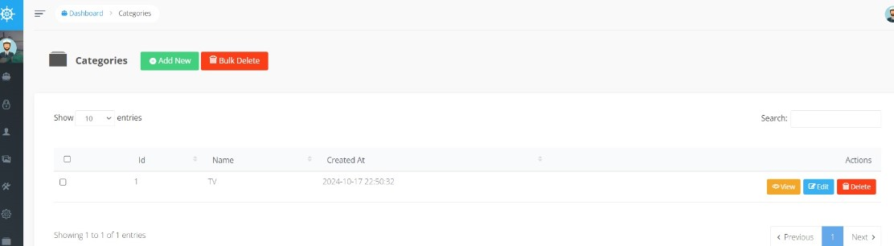    

## 13. Тестирование и отладка Laravel-приложений

Научиться:

- создавать класс-фабрику и класс-наполнитель и использовать их;
-  создавать контроллер и тестировать его с помощью Postman;
-  писать feature-тесты для проверки работы методов контроллера.

Что нужно сделать:

В этой практической работе вы реализуете уведомления через внешние сервисы.

1. Создайте новый проект Laravel или откройте уже существующий.

2. Создайте новую ветку вашего репозитория от корневой (main или master).

3. Создайте сущность Product (модель, миграцию и контроллер) командой `php artisan make:model Product -mc`.

4. Опишите миграцию для таблицы products c типами полей:
```
$table->string('sku');
$table->string('name');
$table->decimal('price', 9, 3);
```

5. Выполните миграцию командой `php artisan migrate`.


6. Добавьте в файл api.php маршруты:

   `Route::apiResource('products', \App\Http\Controllers\ProductController::class);`

7. Создайте класс-фабрику для сущности Product c помощью команды `php artisan make:factory ProductFactory`.

8. Создайте класс-наполнитель для сущности Product c помощью команды `php artisan make:seeder ProductsSeeder`.

9. Выполните команду `php artisan migrate –-seed` для наполнения базы данных сгенерированными данными.

10. В классе ProductController реализуйте методы index, show, store, update, destroy.

11. Протестируйте каждый из маршрутов контроллера ProductController с помощью Postman и приложите скриншоты ответа на запросы в папку postman-screenshots (названия файлов должны соответствовать формату index.jpeg, show.jpeg, store.jpeg, update.jpeg, destroy.jpeg для каждого метода, соответственно).

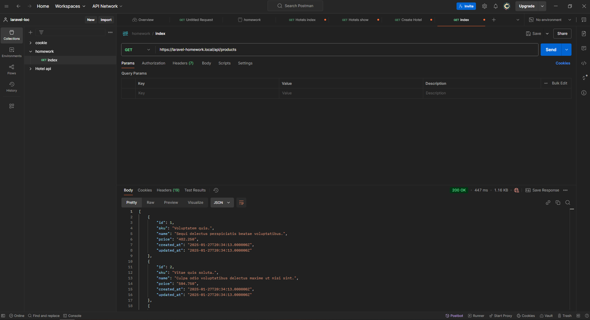

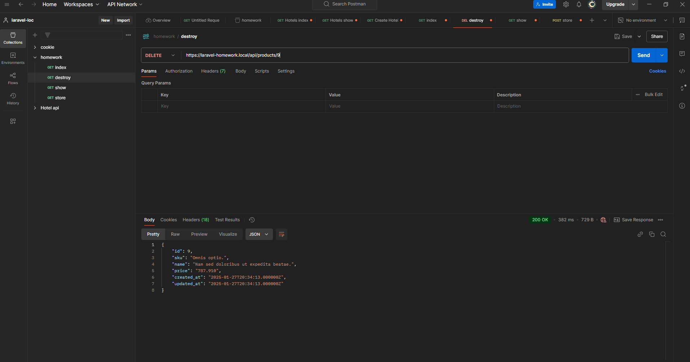

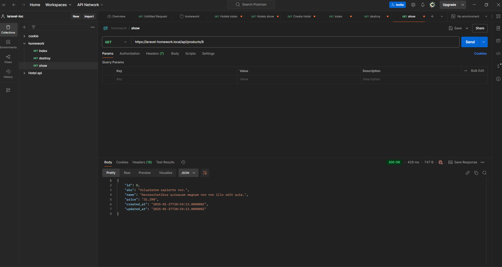

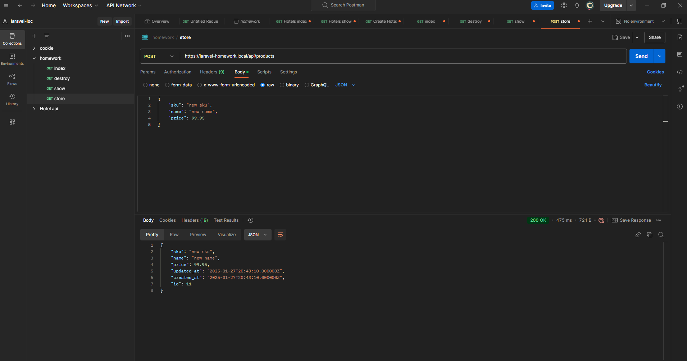 

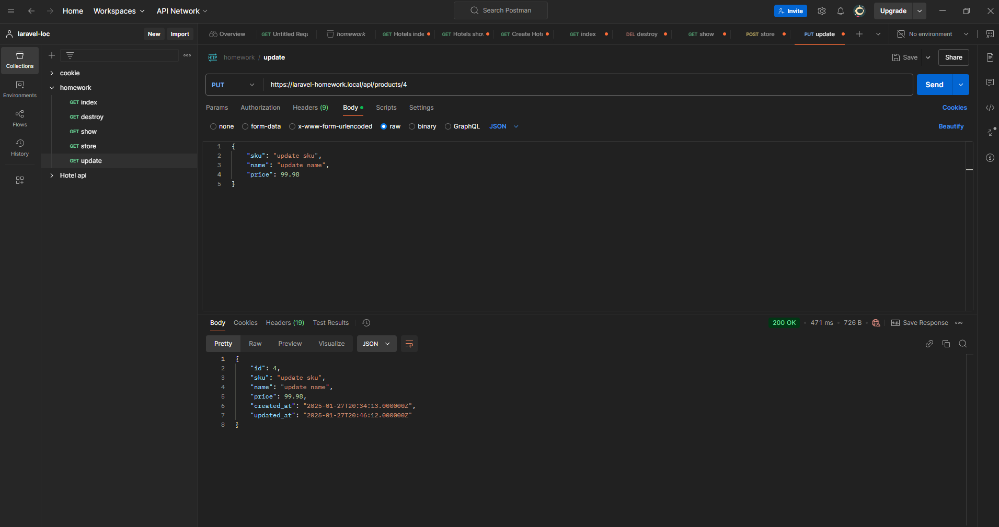

12. Создайте тест c помощью команды `php artisan make:test Products/ProductTest`

13. Опишите функции:
```
test_products_can_be_indexed,
test_product_can_be_shown,
test_product_can_be_stored,
test_product_can_be_updated,
test_product_can_be_destroyed.
```
14. Запустите выполнение тестов командой `php artisan test`.

## 12. Интеграция с внешними сервисами

Научиться:
- интегрировать отправку писем через почтовый клиент;
- настраивать отправку сообщений в мессенджер.

Что нужно сделать:

В этой практической работе вы реализуете уведомления через внешние сервисы.

1. Создайте новый проект Laravel или откройте уже существующий.
2. Создайте новую ветку вашего репозитория от корневой (main или master).
3. Настройте регистрацию и аутентификацию пользователей.
4. Настройте почтовый клиент любого сервиса.
5. Впишите в файл .env нужные значения для почтового сервиса.
6. Создайте письмо Welcome.php командой `php artisan make:mail Welcome`.
7. В конструкторе класса присвойте свойству класса $user параметр конструктора класса.

```
public User $user;
public function __construct(User $user)
{
$this->user = $user;
}
```

8. Создайте шаблон мейлинга welcome.blade.php в директории resources/views/emails с кодом внутри

`Добрый день, {{ $user->name }}, спасибо за регистрацию.`

9. Добавьте код отправки вашего письма в функцию store класса `RegisteredUserController.`
10. Подключите клиент мессенджера Telegram командой `composer require irazasyed/telegram-bot-sdk`
11. Создайте бота и канал, добавьте бота в телеграм-канал.
12. Укажите в файле .env значения, необходимые для работы бота.
13. Проверьте работу бота с помощью тестового маршрута.

```
Route::get('test-telegram', function () {
Telegram::sendMessage([
'chat_id' => env('TELEGRAM_CHANNEL_ID', ''),
'parse_mode' => 'html',
'text' => 'Произошло тестовое событие'
]);
return response()->json([
'status' => 'success'
]);
});
```

14. Добавьте код уведомления в мессенджер о новом пользователе вашей системы в функцию store класса RegisteredUserController.
15. Зарегистрируйтесь на сайте.
16. Проверьте, что сообщение отправлено на электронную почту (рекомендуется использовать для регистрации тот почтовый ящик, с которого отправляется сообщение, чтобы избежать блокировки адреса за спам).
17. Проверьте, что в Telegram пришло уведомление о регистрации нового пользователя.


## 11. Реализация авторизации

Научиться:

- интегрировать регистрацию и аутентификацию пользователей;
- разрабатывать механизмы авторизации действий пользователей системы;
- проектировать ролевую модель системы.

Что нужно сделать:

В этой практической работе вы реализуете проект, в котором будут использованы механизмы авторизации и аутентификации пользователей.

1. Создайте новый проект Laravel или откройте уже существующий.

2. Создайте новую ветку вашего репозитория от корневой (main или master).

3. Установите библиотеку Laravel Breeze `composer require laravel/breeze`.

4. Установите файлы библиотеки `php artisan breeze:install`.

5. Соберите фронтенд проекта с помощью команд npm install && npm run dev.

6. Перейдите на ваш сайт и проверьте работу механизмов регистрации и аутентификации.

7. Создайте контроллер UsersController командой `php artisan make:controller UsersController`.

8. Создайте в классе UsersController функцию index, которая вернёт список всех пользователей системы.

9. Напишите маршрут ‘/users’ в файле web.php.

10. Создайте миграцию, которая добавит поле is_admin типа boolean в таблицу users.

11. Создайте политику `php artisan make:policy UserPolicy --model=User` и напишите функцию.

```
public function viewAny(User $user)
{
return $user->is_admin;
}
```

12. Зарегистрируйте политику в классе AuthServiceProvider.
```
protected $policies = [
User::class => UserPolicy::class,
];
```

13. Используйте авторизацию действий пользователя внутри контроллера UsersController в функции index.
    `$this->authorize('view-any', User::class)`;

14. Создайте двух пользователей, дайте одному из них роль администратора и попробуйте перейти на маршрут ‘/users’ вашего проекта сначала за неаутентифицированного пользователя, а далее за обычного пользователя и администратора системы.


## 10. Встроенные возможности Laravel
Научиться:

- создавать асинхронные задачи и вызывать их;
- настраивать очередь через базу данных и добавлять в неё задачи;
- выполнять задачи через планировщик задач Laravel.

В рамках практической работы вы реализуете очистку файла логирования приложения с помощью асинхронной задачи, помещенной в планировщик задач.

Что нужно сделать:

1. Создайте новый проект Laravel или откройте уже существующий.

2. Создайте новую ветку вашего репозитория от корневой (main или master).

3. Создайте миграцию для очереди через базу данных командой `php artisan queue:table`.

4. Выполните миграцию.

5. Пропишите в файле `.env QUEUE_CONNECTION=database`.

6. Создайте класс `ClearCache.php` с помощью команды `php artisan make:job ClearCache`.

7. В файле ClearCache.php пропишите код для очистки лог-файла.


8. Поместите вызов Job в планировщик задач Laravel в файле app/Console/Kernel.php.


9. Запустите очередь командой `php artisan queue:listen`.

10. Запустите планировщик задач командой `php artisan schedule:work` и не закрывайте терминал.


## 9. Работа с событиями
Цели практической работы:

Научиться:

— создавать события и вызывать их;
— создавать слушатели и привязывать их к событию;
— применять наблюдатели моделей.

Что нужно сделать:

1. Создайте новый проект Laravel или откройте уже существующий.

2. Создайте новую ветку вашего репозитория от корневой (main или master).

3. Создайте миграцию командой php artisan make:migration CreateNewsTable со следующими полями:


4. Создайте модель News.

5. Создайте событие NewsHidden и присвойте полю класса $news параметр $news в конструкторе класса.


6. Создайте слушатель NewsHiddenListener, в котором опишите логику слушателя, используя функцию:
   Log::info(‘News ’ . $event->news->id . ‘ hidden’);.

7. Зарегистрируйте событие и слушатель в классе EventServiceProvider.

8. В файле routes/web.php создайте необходимый маршрут ‘/news/create-test’, использующий метод get для создания тестовой новости, и пропишите логику создания тестовой новости.


9. В файле routes/web.php создайте необходимый маршрут, использующий метод get ‘/news/{id}/hide’ для скрытия новости. Измените атрибут is_hidden на значение true. После этой операции вызовите событие NewsHidden с помощью инструкции NewsHidden::dispatch($news);.


10. В файле storage/logs/laravel.log проверьте, сработал ли слушатель, в нём должна появиться строка ‘News hidden 1’, где 1 — это id скрытой новости (может отличаться).

11. Создайте класс-наблюдатель NewsObserver.

12. Зарегистрируйте его в файле App\Providers\EventServiceProvider в функции boot.

13. Опишите логику изменения поля slug новости при вызове события saving в наблюдателе NewsObserver с помощью инструкции.


Эта инструкция использует класс Str, который можно подключить с помощью инструкции в начале файла.


14. Создайте ещё одну новость с помощью маршрута ‘/news/create-test’.

15. Проверьте заполнение поля slug через базу данных. Оно должно выглядеть следующим образом: «test-news-title» (если вы оставили такое же название, как в примере).

16. Сделайте коммит изменений с помощью Git и отправьте push в репозиторий.


## 8. Сервисы: создание и использование
   Цели практической работы:

Научиться:

— создавать свои сервисы на Laravel;
— работать с логами Laravel и их обработкой.

Что нужно сделать:

В этой практической работе вы разработаете сервис логирования, который:
— фиксирует обращения к сайту;
— собирает их в базе данных с возможностью отключения системы логирования;
— отражает в реальном времени HTTP-запросы к приложению.

Создадим новый проект:

composer create-project laravel/laravel log-service

### 1. Для начала создадим модель логов. Для создания модели необходимо использовать artisan с параметром make:model.
   В итоге наша команда будет выглядеть так:

```php artisan make:model Log```

По умолчанию модель создаётся в ./app/Models/Log.php.
Модель создана, для избежания ошибок запросов SQL необходимо отключить автоматические метки времени.


### 2. Теперь опишем миграцию для создания нашей таблицы логов:

```php artisan make:migration create_logs_table```

Напомним, что таблицы миграции создаются по умолчанию в /database/migration/current_date_time_create_logs_table.php.

По умолчанию создаётся файл, содержимое которого выглядит так:


В этом файле нам нужно определить поля, которые будет собирать наш сервис логирования:
— time — время события;
— duration — длительность;
— IP — IP-адрес зашедшего пользователя;
— url — адрес, который запросил пользователь;
— method — HTTP-метод (GET, POST);
— input — передаваемые параметры.

В итоге файл должен приобрести такой вид:


### 3. Миграция создана, параметры описаны. Теперь создадим таблицу.

Напоминаем, что таблица создаётся также через artisan c параметром migrate php artisan migrate.

### 4. База данных подготовлена, теперь нужно создать звено (middleware) для обработки HTTP-запросов. Напоминаем, что звенья создаются при помощи команды php artisan make:middleware название модели.

В нашем случае нам нужна команда:
php artisan make:middleware DataLogger

По умолчанию звено (посредник) создастся по пути ./app/Http/Middleware/DataLogger.php.
Теперь необходимо настроить middleware. Открываем Datalogger.php. Добавим использование созданной модели.


Также нужно завершить создание middleware DataLogger, зарегистрировать его в ./app/Http/Kernel.php.


### 5. Модель создана, посредник HTTP-запросов настроен и зарегистрирован как класс в Kernel.php. Если сейчас запустить Laravel командой php artisan serv, всё будет работать. Логи будут записываться в базу данных.
   Но увидеть это можно только в самой базе SQL. Для получения более наглядных результатов необходимо создать в web.php эндпоинт.


Также для этого эндпоинта необходимо создать blade-шаблон: ./resource/view/logs.blade.php

В нём создать запрос к базе SQL и вывод логов в таблицу.


Запускаем приложение, при открытии вашего приложения http://localhost:8000/logs должна открываться таблица с логами обращения к сайту.


## 7. Формирование ответа (Response)
Цели практической работы:

Научиться:

— использовать класс Laravel Response на практике;
— создавать CRUD REST API на базе фреймворка Laravel;
— передавать данные в формате PDF в ответе экземпляра класса Response.

Что нужно сделать:

В этой практической работе вы будете разрабатывать контроллер, который позволит выводить информацию об одном и обо всех пользователях из базы данных, сохранять данные о новом пользователе в БД, а также создавать PDF с информацией о пользователе.
### 1. Установите новое приложение Laravel и настройте подключение к базе данных. Напомним, что создать новое приложение можно с помощью команды composer:

```composer create-project laravel/laravel crud```

Добавьте необходимые переменные окружения в ENV-файл корневого каталога приложения.

 

### 2. Создайте новую модель Eloquent c помощью команды:

```php artisan make:model User -mfsc```

Напомним, что флаг -mfsc создаст модель, наполнитель, контроллер и файл миграции.
После опишите схему базы данных в методе up() файла .app/Http/Models/User.php.


После описания схемы таблицы базы данных запустите миграцию.

### 3. Создайте необходимые роуты в файле web.php. Ваше приложение должно содержать минимум четыре эндпоинта:
   — для получения всех пользователей из БД;
   — получения одного пользователя через id, переданный в параметрах роута;
   — записи нового пользователя в базу данных;
   — получения данных о пользователе в виде PDF-файла.


### 4. Создайте новый blade-шаблон. В blade-шаблоне создайте форму, которая будет отправлять данные о работнике. Важно, чтобы поля HTML-формы были сопоставимы с полями таблицы базы данных. При отправке запроса экземпляр класса request должен содержать данные об имени, фамилии и адресе электронной почты пользователя.
   Форма blade-шаблона должна содержать CSRF-токен, поля формы должны быть обязательны к заполнению (используйте атрибут required).


### 5. В контроллере UserController.php опишите функцию store, которая будет сохранять данные из вашей HTML-формы. Добавьте валидацию.


Дополнительно. Добавьте валидацию на количество символов (максимальное количество символов — 50) для полей Name и Surname. Для почты добавьте валидацию в виде регулярного выражения на соответствие виду example@mail.com.


### 6. Добавьте соответствующие методы index и get, которые будут возвращать данные обо всех пользователях и об одном пользователе по переданному id. Опционально можете возвращать ответ в формате JSON.

### 7. Чтобы генерировать PDF-документ, вам понадобится DOMPDF-пакет, который является сторонней библиотекой. Для его установки выполните команду:

```composer require barryvdh/laravel-dompdf```

— В файле composer.json добавьте строку с указанным пакетом.
— Запустите команду composer update.
— Добавьте необходимый Service Provider и Facade в файл config/app.php.


### 8. Создайте новый контроллер для работы с PDF:

```php artisan make:controller PdfGeneratorController```

### 9. Опишите функцию index, которая будет возвращать новый PDF-файл.


### 10. Измените роут Route::get(‘/resume’) таким образом, чтобы он принимал id в виде параметра. Обновите функцию «index» так, чтобы PDF формировался на основе данных из таблицы по переданному id.
